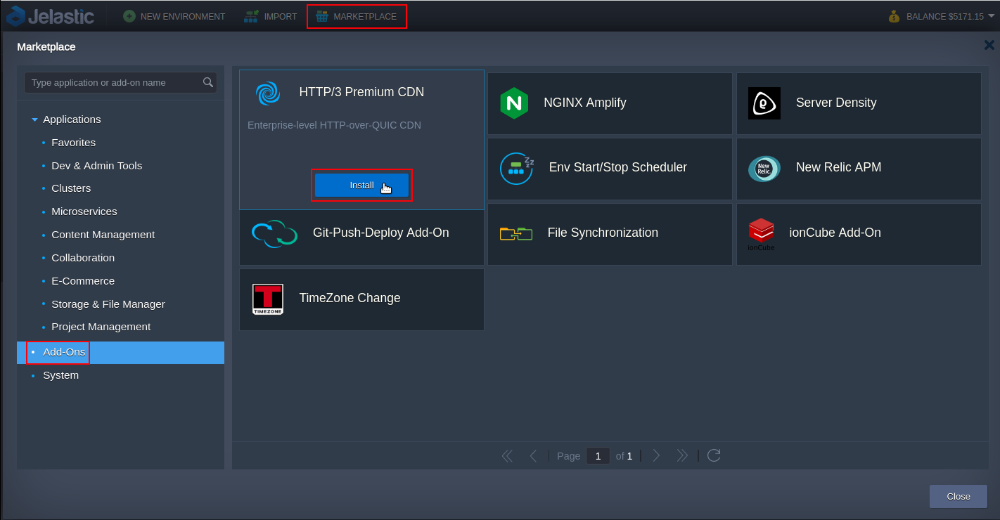
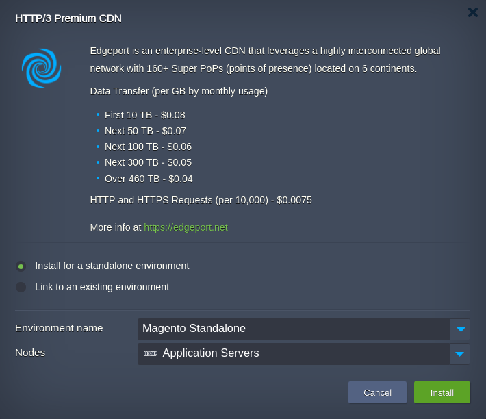
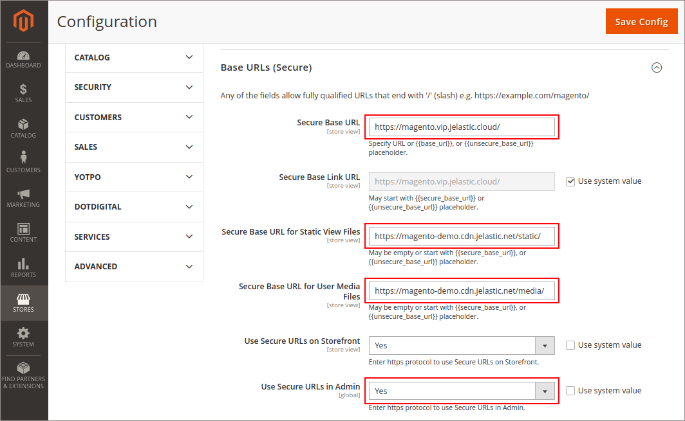
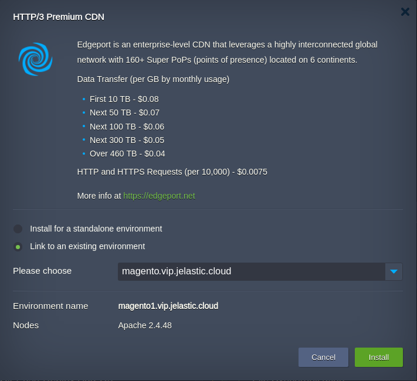
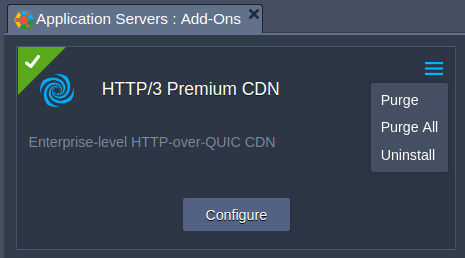
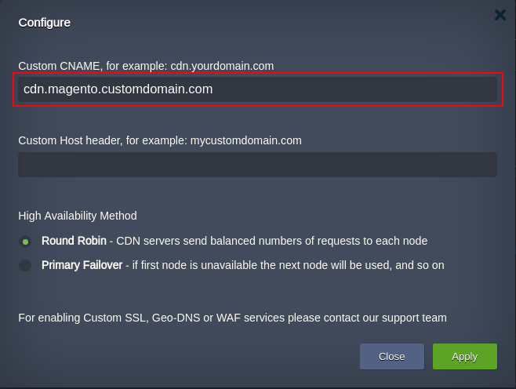
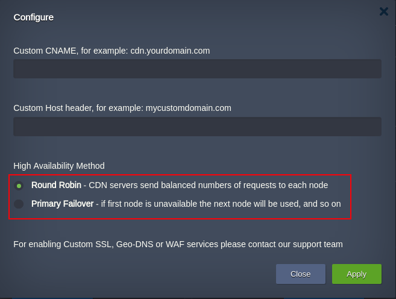
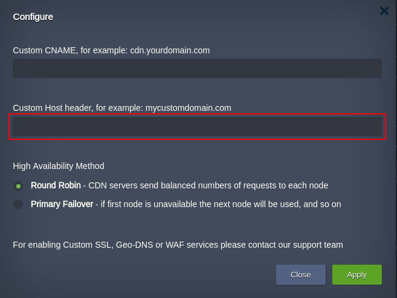

# Jelastic CDN Add-On

Jelastic CDN add-on uses the HTTP/3 Premium Content Delivery Network(CDN) [Edgeport](https://edgeport.net) which is a highly interconnected global network, featuring massive bandwidth capacity, advanced caching and acceleration strategies, fast-routing IP Anycast technology for powerful and lightning-fast performance around the world. 

HTTP/3 or HTTP-over-QUIC (Quick UDP Internet Connections) improves web application performance by up to 60%. Web pages load faster, and viewers enjoy a better experience with content loading more efficiently. HTTP/3 provides better security since it was designed to require traffic encryption by default. 

Here we consider add-on installation and configuration for very popular application such as Magento.

## Installation Process
1. Import the [raw link of the add-on manifest](https://raw.githubusercontent.com/edgeport/cdn/master/manifest.yml) within Jelastic PaaS dashboard or initiate the installation within **Marketplace > Add-Ons**.

> **Note:** To access the dashboard you need to be registered at one of the [Jelastic Public Cloud providers](https://jelastic.cloud/?featuresSupport=CDN).

 

2. In the opened window, choose the environment where CDN should be enabled, the preferred nodes layer and press Install. 

 

 When the installation is finished, you will get a success popup window with the CDN URL in the following format: 
__${env.envName}-${sufix}.cdn.jelastic.net__,  

where **${sufix}** - is a code name of your Jelastic hosting provider automatically generated for the environment hostname upon add-on installation.

 

Within the first hour or less, you may encounter a 404 error as it takes time for the static resources of the new environment to propagate across the CDN.

In order to make the static content of the website downloadable from PoPs, open Magento admin panel. Then click on **STORES > Configuration > Web > Base URLs (Secure)**.

Specify https protocol and the domain name either you chose before environment installation or custom one assigned via A record for the field **Secure Base URL**.

And specify CDN URL for the fields:  

 * __Secure Base URL for Static View Files__: *https://{env.envName}-${sufix}.cdn.jelastic.net/pub/static/*
 * __Secure Base URL for User Media Files__: *https://{env.envName}-${sufix}.cdn.jelastic.net/pub/media/*

Permit access to Magento admin panel via https.

 

To push all of the traffic via https only, repeat the same steps for **STORES > Configuration > Web > Base URLs** section.

Finally, press the **Save Config** button and flush the Magento Cache.

## Addon's Options

### Link Multiple Environments For Extra High-Availability

For multi environment solutions such as geo-distributed applications, the high availability is quite important for dynamic content as well as for static. So if you have the application which consists of two environments are fully synchronized, you can ensure its extra high availability with respect to the static assets cached at PoPs. It is implemented as a possibility to link several environments to the same CDN endpoint. In other words, CDN will be caching the static assets from several origins which are fully synced. 

Follow the steps to get such a solution:

 1. Find the Premium CDN add-on for the second environment and initiate installation selecting the existing one with CDN add-on installed. 

 

 2. The successful installation window appears with the CDN URL which actually refers to the same endpoint the existing environment does. 
 
 
 

Thus the HA mode is achieved with duplicated origins:

 * **magento.vip.jelastic.cloud**
 * **magento1.vip.jelastic.cloud**

So, if one goes down the other will be serving CDN’s requests for static assets caching at the single endpoint: **magento-demo.cdn.jelastic.net**.

3. The last step is to configure the URLs of the second environment the same way as it is described above.

### Purge, Purge All and Uninstall
For cache cleaning of the static assets at PoPs, we can use **Purge** or **Purge All** actions. Once the assets are deleted, the CDN begins downloading their fresh copies from an origin server.

 
 

**Purge** deletes specific assets within the specified path.

Meanwhile, **Purge All** deletes all static assets at the PoPs, just asking the user to confirm cache clearance. The cache renewal process is much faster compared to the first static assets propagation after Add-On installation.

## Bind Custom Domain to CDN 

Once you've attached CDN service, it automatically generates a dedicated domain for your environment ${env.envName}-${sufix}.cdn.jelastic.net as it was described earlier. You can also bind a custom domain (e.g. cdn.magento.customdomain.com) via add-on settings.

1. Press the **Add-Ons** button of the application server instance.
2. Find CDN Add-On and press **Configure**.
3. Fill in **Custom CNAME** field. You can specify multiple domains separating them by space or semicolon (;).

 
 

Once you’ve applied this, the static website content will be available via your custom domain.

## High Availability Method

Within the above-mentioned add-on settings, you can also choose an appropriate method to ensure high-availability mode. 
**Round Robin** (RR) - even distribution of requests among available nodes.
**Primary Failover** (PF) - all requests sent to the first node, if it becomes unavailable the requests are redirected to the next and so on.

 
 
 

During horizontal scaling of the nodes in the application server layer, the platform automatically updates the records of available nodes inside CDN service. It eliminates the necessity to perform any manual actions during scaling events.

## Custom Host Header

If required to run multiple websites on your Magento the only one can be served by CDN. Therefore you have to tune the CDN Add-On in that to distinguish the domain the static assets should be taken from. 

Open the Add-Ons tab and click on the **Configure** button. 
Then put a custom domain of the website you prefer to be served via CDN into the custom header field. 

 
 
 

